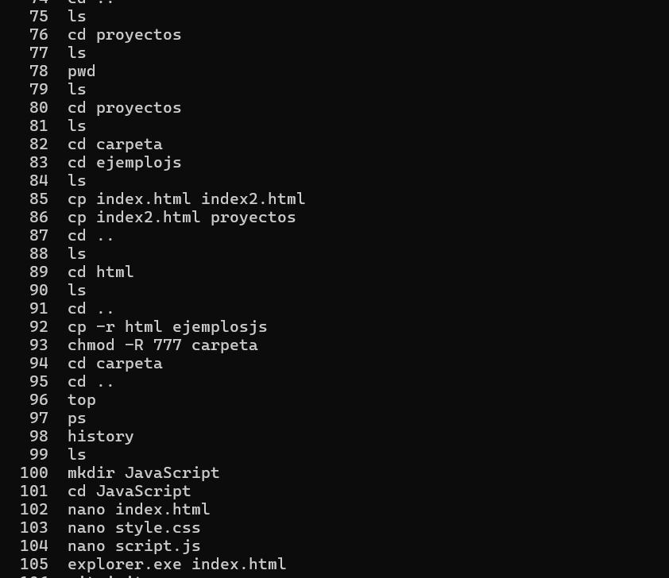
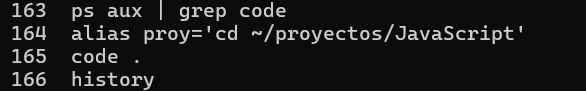

# Proyecto Ubuntu

## Comandos Linux

### Comandos Basicos

- ls Lista archivos y carpetas
- cd Cambia de directorio
- cp Copia archivos o carpetas
- mv Mueve o renombra archivos
- rm Elimina archivos o carpetas
- chmod Cambia permisos
- chown Cambia propietario
- top Procesos en tiempo real
- ps Lista procesos activos
- kill Finaliza procesos

### Comandos intermedios

- find Buscar archivos por nombre
- grep Buscar texto dentro de archivos
- apt / yum / dnf Gestión de paquetes
- free Uso de memoria
- df Uso de disco
- du Tamaño de carpetas
- htop Monitoreo interactivo
- adduser Crear usuario
- usermod Modificar usuario / grupos
- groups Ver grupos de un usuario
- ip Interfaces de red
- ping Probar conectividad
- netstat Puertos en uso
- tar Comprimir/Descomprimir
- zip / unzip Comprimir / Descomprimir

### Comandos Avanzados

- ps aux | grep Buscar procesos por nombre
- pkill Finalizar procesos por nombre
- alias Crear alias de comandos
- history Ver historial de comandos
- !<cmd> Ejecutar último comando que inicia con <cmd>
- crontab Programar tareas automáticas
- scp Transferir archivos scp archivo.txt usuario@192.168.1.10:/home/
- ssh Conexión remota a servidor ssh usuario@ip_servidor

